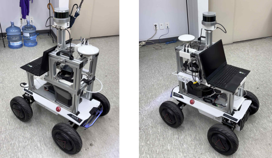

# Auto-Where
2025-1 드림학기제 Auto-Where 팀

---

[AutoWhere 팀 최종 시연 영상 (YouTube)](https://youtu.be/_5tRZfBbu1g)

## 🚗 프로젝트 소개

2025-1 ‘드림학기제’를 통해, 건국대학교 캠퍼스 내부에서 자율주행 UGV 차량을 실제로 주행할 수 있는 **Autoware 기반 자율주행 플랫폼**을 구축하였습니다.  
국제적으로 표준화된 Autoware 오픈소스 SW를 활용하여, 캠퍼스 환경에 최적화된 PointCloud Map과 OSM Map을 제작하고, 이를 실제 차량 주행에 적용함으로써 단순 시뮬레이션 검증을 넘어 **실차 환경**에서 자율주행 알고리즘을 운용할 수 있는 시스템을 개발하였습니다.

---

## 🎯 프로젝트 목표

- 건국대학교 캠퍼스 내부에서 UGV 차량의 자율주행 실증
- 3D LiDAR 기반 PointCloud Map 제작 및 Lanelet2 기반 OSM Map 구축
- ROS2 기반 Autoware 플랫폼을 통해 자율주행 제어 신호(control_cmd)를 발행하고  
  이를 **ROS2-CAN 브릿지**를 통해 차량의 CAN 네트워크로 전달
- 차량 구동 및 센서데이터 수집, 제어까지 통합된 자율주행 SW 아키텍처 구현

---

## 🗓️ 개발 기간

**2025.03 ~ 2025.06**

## 🗺️ 캠퍼스 OSM + PointCloud Map


---

## 🚗 UGV 차량 구조




## 🛠️ 시스템 구성

```plaintext
Autoware Platform
    ↓
(control_cmd topic 발행)
    ↓
ROS2-CAN Bridge
    ↓
CAN-USB
    ↓
UGV 차량 ECU
